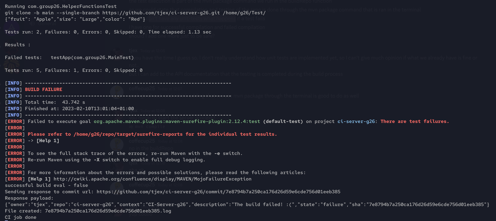
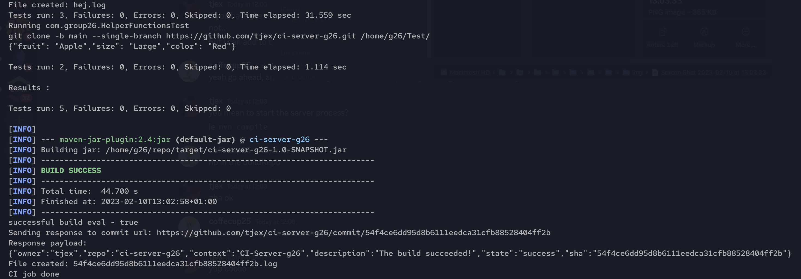

# ci-server-g26

## TOC

- [The CI Server](#the-ci-server)
    - [The Personal Access Token](#the-personal-access-token---very-important!)
- [HTTP Server](#http-server)
- [Function Deep Dive](#function-deep-dive)
    - [cloneReposiory()](#cloneRepository)
    - [buildRepo()](#buildRepo)
    - [sendResponse()](#sendResponse)
- [Testing the Server](#testing-the-server)
- [Building and Testing the Source Code](#building-and-testing-the-source-code)
- [Statement of Contributions](#statement-of-contributions)
- [Essence Standard](#essence-standard)

This repo is the codebase for a continuous integration server.   
The server acts as an automated build status reporting tool that communicates 
with Github on the functionality of commited code. The process is as follows:

1. code is pushed to Github from a local repo
2. Github registers the push and sends a json package to the server
3. the server clones the repo, 
4. builds the resultant code, 
5. formats a response destined for Github based on the build result and
6. sends the response (headers and json) back to Github

The response back to Github contains the status of the build. Github accepts 
`error`, `faliure`, `pending` or `success` state messages. This response is displayed 
alongside the commit in Github.

Through this process developers can work together with greater fluidity due 
to a shared, automated and established build and test environment.  
This means greater transparency in the reliability of the proposed code and 
and opportunity to continuously integrate code smoothly into production.

## The CI Server

The server itself is a Raspbery PI running ngrok and a simple Java HTTP server.   
For setting up ngrok refer to their [get started guide](https://ngrok.com/docs/getting-started).   
For setting up a webhook for your repo, see the [Github docs](https://docs.github.com/en/developers/webhooks-and-events/webhooks/about-webhooks).   

The usage of ngrok means you can use any machine as a continuous integration server, including your own local machine.

### The Personal Access Token - Very Important!

In order for the server's response to be validated by Github, a personal token must be included in the server's response. 
This allows Github to verify that the response it has received has some form of write access to the repo in question.
It is this write access that allows the commits to be updated with symbols / descriptions and other actions that you wish 
to execute on Github based on your server's response.

(At the time of writing) To generate a token, go to your personal Github settings -> Developer.

Once you have your token, add it to your server by running `export CI_TOKEN=<your-token>`.   
Then in your program, access it with your languages method.   
In the case of Java: `String token = System.getenv("CI_TOKEN");`

Note: the export variable is only accessible within the shell session in which you run the `export` command. 
If you exit the session, the variable will be lost.   
To make it persist, add the same `export` command to your terminals startup config, for example `.bashrc`

```diff
- WARNING:
- do not paste your token directly into your server's code. 
- this is a security risk.
```

## HTTP Server 

The server process running on the Raspberry PI (that handles receiving / sending http requests) 
is below. It simply listens on port 8026 to incoming HTTP requests and routes them to our Java program: 

```java
// ../src/main/java/org/group26/ContinuousIntegrationServer.java

	public static void main(String[] args) throws Exception
	{
		Server server = new Server(8026);
		server.setHandler(new ContinuousIntegrationServer());
		server.start();
		server.join();
	}
```

## Program Breakdown

Apart from the HTTP server, the program is esentially contained within two `if` statements and follows the below sequence:
1. We check if a push event from Github has been received
2. We try to clone the repository -> exception on fail
3. We try to build the cloned repository. 
    - a response is subsequently sent to Github which contains:
        - a `success` state if the build was successfull
        - a `fail` if the opposite true
4. We send a response back to Github with the result of the build.

```java 
// ../src/main/java/org/group26/ContinuousIntegrationServer.java

		// Get payload as JSON
		JSONObject requestJson = HelperFucntion.getJsonFromRequestReader(request.getReader());
		boolean buildEval = false;
		if(pushEvent) {
			boolean status;
			try {
				status = cloneRepository(requestJson);
				if (status)
					System.out.println("Successfully cloned repository");
					System.out.println("Starting build of cloned repo");
					buildEval = buildRepo();
			} catch (Exception e) { e.printStackTrace(); }
		}
		String commitURL = requestJson.getJSONObject("head_commit").getString("url");

		if(buildEval){
            System.out.println("successful build eval - true");
			sendResponse(CommitStatus.SUCCESS, commitURL);
		}
		else{
            System.out.println("successful build eval - false");
			sendResponse(CommitStatus.FAILURE, commitURL);
		}


```

## Function Deep Dive

Below are the function definitions used above.

### cloneRepository()

Here we receive a json payload from the Github webhook and clone the repository.

```java
// ../src/main/java/org/group26/ContinuousIntegrationServer.java

	public boolean cloneRepository(JSONObject payload) throws IOException, InterruptedException {
		// Gets the relevant info from json file such as clone url and branch
		JSONObject repo = (JSONObject) payload.get("repository");
		String cloningURL= repo.getString("clone_url");
		System.out.println("cloningURL: " + cloningURL);
		String branch = payload.getString("ref");
		String[] refs = branch.split("/");
		int counter = 0;
		branch = "";
		for (String bra:refs) {
			if(counter > 1){
				branch += bra;
			}
			counter ++;
		}
		HelperFucntion.gitClone(cloningURL, branch, ContinuousIntegrationServer.PATH);
		
		// Returns true if repository was successfully cloned
		File file = new File(ContinuousIntegrationServer.PATH + "ci-server-g26/");
		return file.isDirectory();
	}

```

### buildRepo()

Here in the buildRepo() function we build and test the cloned repository.   
ie `ProcessBuilder probbuilder = new ProcessBuilder(new String[]{"mvn","package"});`

With this process we receive a log output from which we can see the test results and 
build state.  

```java
// ../src/main/java/org/group26/ContinuousIntegrationServer.java

	public boolean buildRepo() throws IOException, InterruptedException {
		File file = new File(PATH);

		System.out.println(file.isDirectory() + " is directory " + file.getName());

		ProcessBuilder probbuilder = new ProcessBuilder(new String[]{"mvn","package"});
		probbuilder.directory(file);
		Process pro = probbuilder.start();
		pro.waitFor();
		File jarFile = new File(PATH + "target/");
		System.out.println(jarFile.isDirectory() + " is directory " + jarFile.getName());
		BufferedReader bufferedReader = new BufferedReader(new InputStreamReader(pro.getInputStream()));
		String log = "";
		String line = "";
		boolean buildBoolean = false;
		while ((line = bufferedReader.readLine()) != null){
			System.out.println(line);
			log += line + "\n";

			if(line.contains("BUILD") && line.contains("FAILURE")){

				buildBoolean = false;
			}
			if(line.contains("BUILD") && line.contains("SUCCESS")){
				buildBoolean = true;
			}
		}
		return buildBoolean;
	}

```

### sendResponse()

After the build is done, a response is formatted to be sent to Github.

```java
// ../src/main/java/org/group26/ContinuousIntegrationServer.java

	public void sendResponse(CommitStatus status, String commitUrl) throws IOException {
		
		System.out.println("Sending response to commit url: " + commitUrl);
		
		String token = System.getenv("CI_TOKEN");
		
		// Get commit id from URL
		String[] split = commitUrl.split("/");
		String commitId = split[split.length - 1]; 
		
		CloseableHttpClient client = HttpClientBuilder.create().build();

		HttpPost response = new HttpPost("https://api.github.com/repos/tjex/ci-server-g26/statuses/" + commitId);
		response.setHeader("Authorization", "Bearer " + token);
		response.setHeader("Content-type", "application/json");
		response.setHeader("Accept", "application/vnd.github.v3+json");

		JSONObject body = new JSONObject();
		body.put("owner", "tjex");
		body.put("repo", "ci-server-g26");
		body.put("sha", commitId);
		body.put("state", status.toString().toLowerCase());
		StringEntity params = new StringEntity(body.toString());
		response.setEntity(params);

		System.out.println("Response payload:");
		System.out.println(body.toString());
		
		// Send POST to GitHub	
		client.execute(response);
	}

```
## Testing the Server

In order to test the CI server process we had an 'assessment' branch, on which commits would be pushed 
that were expected to result in a build success of failure. 

The process was as follows:

1. cd into repo root.
2. `git checkout assessment` and either,
    - make a minor non breaking change, commit and push = successful build
    - break the code (eg, see below), commit and push = failed build

```java
//../src/test/java/com/group26/MainTest.java
    public void testApp() {
        // change 'true' to 'false' = build fail
        assertTrue(true);
    }
```

Output of a filed build:   


Output of a successful build:   


## Building and Testing the Source Code

Requirements:

- Java 11 or higher.
- Maven

To build and test the project: 

1. `git clone https://github.com/tjex/ci-server-g26.git`
2. `cd ci-server-g26`
3. `mvn test`
4. `mvn compile`
5. `mvn exec:java -Dexec.mainClass=org.group26.ContinuousIntegrationServer`

## Statement of Contributions

- Anders Blomqvist
    - java docs documentation
    - helped with git clone function
    - implementation of server communication back to Github
    - assistance with project setup
- Arasp Keighobad
    - help with server configuration and testing
    - help with debugging
- Arian Hanifi
    - initial build function development (later finalised Michael)
    - project structure assistance
    - build logging
    - debugging
- Michael Morales Sundstedt
    - communication handling from webhook to JSONObject
    - git cloning the branch of which the webhook was pushed from
    - test for both of the above
    - completion of build funcion
- Tillman Jex
    - raspberry pi server setup and management
    - webhook setup
    - server response debugging
    - automated build process and response aquisition debugging
    - readme documentation

## Essence Standard 

Our way of working that we developed in the [previous project](https://github.com/tjex/decide-g26) 
needed to evolve to achieve this project. It was difficult to split the project into atomic tasks 
as each component relied heavily on the previous component being completed in order to define the structure 
of its output and subsequent data handeling. This meant that we had to shift more towards a group programming style, where 
multiple people would work on one person's machine to build each component. We found that this often lead to a much 
faster resolution of bugs and provided good forsight towards general issues with program design.

We decided on a set of tools and became aquainted with them. This related in particular to the chosen server setup, 
a Raspberry PI 4. As the server needed to be consistently updated and worked on, we assigned some members of the team 
to in essence be system admins. This reduced the cognitive load from all as each party had either a responsibility to be 
focussed on the code generation or the implementation and management of the server. However, due to the fluidity of excellent 
verbal communication found in this group, all team members were equally able to apply themselves to writing code, debugging and 
working with the server. 

We are pleased to report that all members of the team feel they were included and respected equally in the process of both design and implementation, 
and are equally proud of the solutions developed and the functionality of the end result. 

